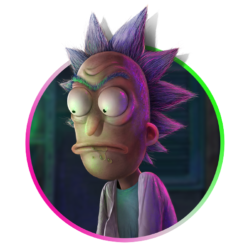

<head>
  <meta charset="UTF-8">
  <meta http-equiv="X-UA-Compatible" content="IE=edge">
  <meta name="viewport" content="width=device-width, initial-scale=1.0">
  <title>Rick and Morty</title>
  
</head>

<body>
    

      
      

          

              API UTILIZADA
              <a style="text-decoration: none; color: #7bf51e;" href="https://rickandmortyapi.com/">RICK AND MORTY</a>
          

      

    

      

        <h2>CURSO</h2>
        
Análise e Desenvolvimento de Sistemas

    

      

        <h2>MATÉRIA</h2>
        
Desenvolvimento de Aplicações para a Internet

    

      

        <h2>ALUNO</h2>
        
Giovanna Gabriele Costa Batista || RA: 193225-2

    

      

        <h2>OBJETIVO</h2>
        
O objetivo de criar um website usando a API Rick and Morty é fornecer informações 
          detalhadas sobre os personagens, episódios e locais da série. Como uma lista de personagens 
          com informações detalhadas, uma página de pesquisa, uma seção de curiosidades sobre episódios, 
          um mapa interativo de locais e uma galeria de imagens.

    

  </body>
